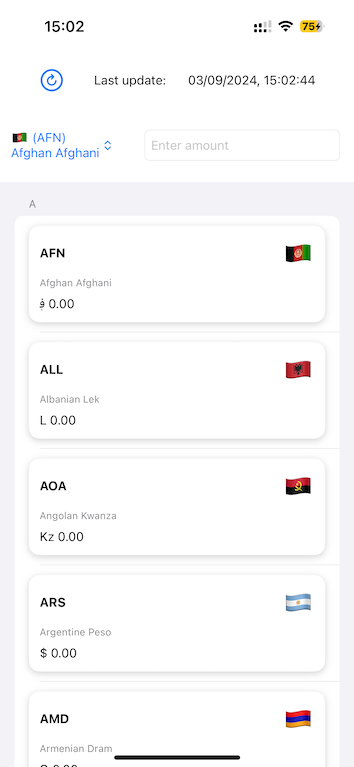
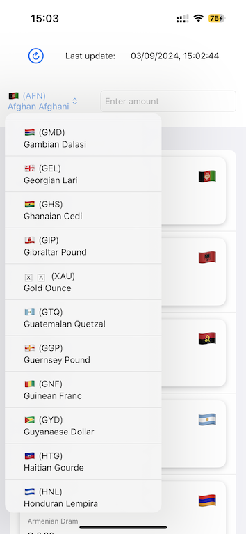

# ConvertPal

ConvertPal is a mobile application built using Swift and SwiftUI for seamless currency conversion. It leverages the RESTful API provided by [Open Exchange Rates](https://openexchangerates.org/) to fetch up-to-date exchange rates.

## Features

- Swift and SwiftUI-based user interface for an intuitive user experience.
- Real-time currency conversion using Open Exchange Rates API.
- Support for a wide range of currencies for accurate conversions.
- Simple and user-friendly design.

## Screenshots




## Getting Started

To get started with ConvertPal, follow these steps:

1. Clone the repository:

   ```bash
   git clone https://github.com/sirdarvs/convert-pal.git

2. Set up your Open Exchange Rates API Key:
 - Obtain a 'FREE' API key from Open Exchange Rates.
 - Copy your API URL like https://openexchangerates.org/api/latest.json?app_id=#####.
 - In Xcode, locate the CurrencyViewModel.swift file within the project navigator.
 - Replace the URL on line 83 with your actual API URL.
3. Build and run the application:
 - Choose a simulator or connect a physical device to your Mac.
 - Press the "Run" button in Xcode or use the shortcut Cmd + R.
4. Explore ConvertPal:
 - Once the application is running, explore the currency conversion features.
 - Enter an amount, select the source currency, and choose the target currency to see the converted amount.

## API Reference

For currency conversion, ConvertPal uses the Open Exchange Rates API. You can find the API documentation [here](https://openexchangerates.org/).
